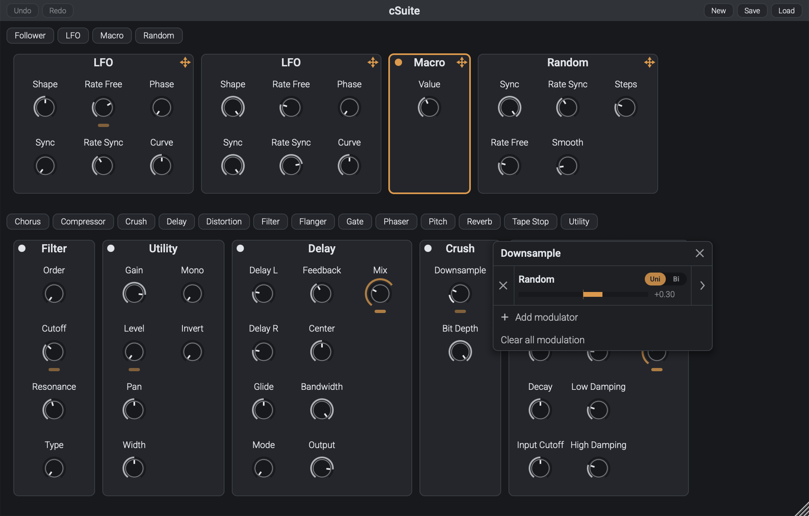

# cSuite

<p align="center"></p>

## Overview

cSuite is a semi-modular audio effects rack with a flexible modulation system and intuitive interface. Available for macOS, Windows, and Linux in VST3, CLAP, and AU (macOS only) formats.

You can download the latest version from the [releases](https://github.com/calgoheen/cSuite/releases) page.

### Features

- Add as many effects and modulators as you need
- Drag-and-drop audio rate modulation
- Modulate an existing modulation's depth parameter
- Save and load presets
- Undo and redo support
- Resizable interface

### Effects

Choose from 13 effects, with support for multiple instances of each:

**Chorus, Compressor, Crush, Delay, Distortion, Filter, Flanger, Gate, Phaser, Pitch, Reverb, Tape Stop, Utility.**

### Modulators

Assign any of the 4 modulators to any parameter:

**Envelope Follower, LFO, Macro, Random.**

Modulation targets can include other modulators’ parameters and the depth of an existing modulation. Create assignments via drag-and-drop or by right-clicking any knob.

## Build instructions

### Prerequisites

- [CMake](https://cmake.org/)
- [Ninja](https://ninja-build.org/)

### Build

```
# Clone the repo
git clone --recurse-submodules https://github.com/calgoheen/cSuite.git
cd cSuite

# Configure and build
cmake --preset release
cmake --build --preset release
```

## Contributing

Bug reports and feature requests are welcome through GitHub Issues. Pull requests are not currently accepted.

## License

cSuite is open-source and licensed under the [GNU GPLv3](LICENSE.md). Third-party dependencies are covered by their respective licenses; see the linked projects under **External dependencies**.

## External dependencies

- [JUCE](https://github.com/juce-framework/JUCE)
- DSP modules from [chowdsp_utils](https://github.com/Chowdhury-DSP/chowdsp_utils)
- CLAP plugin format is built with [clap-juce-extensions](https://github.com/free-audio/clap-juce-extensions)
